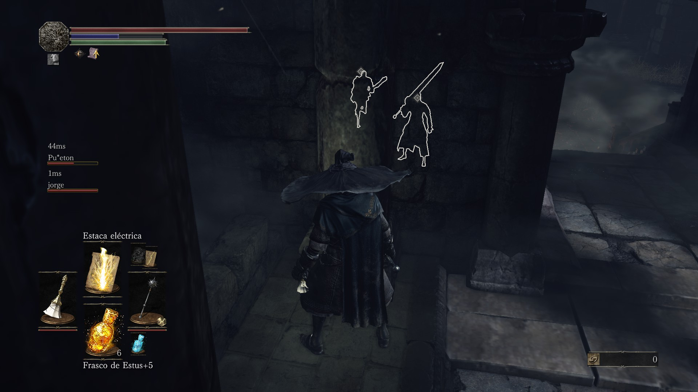
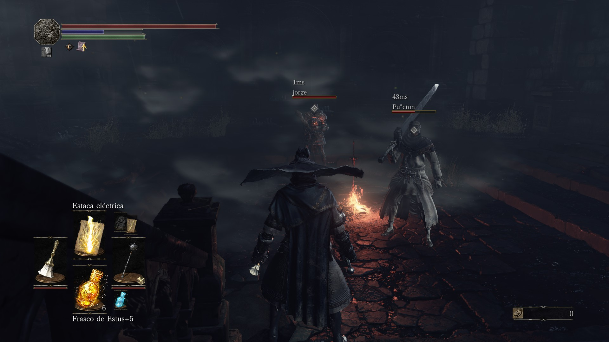

# The Ashen Link: DS3 Coop

A modular companion modification and enhancement suite for **Dark Souls III co-op**.

---

## Features & Roadmap Status

| Component / Feature | Category | Status | Notes / Known Issues |
| :--- | :--- | :--- | :--- |
| **Custom Menu Integration** | UI / Core | **Working / Stable** | Native Scaleform button hook (RVA `0xEE1150`) with exact game button hitbox. Also accessible in-game via `F7`. TrueType typography with INI synchronization. |
| **Companion Spawner (Ash Stone)** | Gameplay / AI | **Working** | Modular companion summon system (Ash Stone); functional companion NPC summoning. |
| **Guest Bonfires Restoration** | World Fix | **Working / Patched** | Fixes bonfire checkpoint write-back (`+0xacc`) for guest players so resting and respawns work properly. |
| **FPS Unlocker (Uncap 60 FPS)** | Performance / Engine | **Working / Stable** | Uncaps Dark Souls III native 60 FPS limit with customizable target framerate (144, 165, 240+ FPS), VSync toggle, and real-time F7 menu integration. |
| **Combat Stat Counters** | Overlay / Stats | **Working / Stable** | Optional in-game HUD tracking session kills, deaths, and backstabs. |
| **Ally Diamond Markers** | Render / UI | **Working / In Progress** | Real-time 3D overhead position markers for co-op allies; undergoing polish and refinement. |
| **Ally Outlines & Silhouettes** | Render (D3D11) | **Working / In Progress** | Direct3D 11 shader pass for occluded silhouettes behind walls; functional, undergoing optimization. |
| **Hit Synchronization** | Network / Combat | **Buggy / In Progress** | Damage registration and weapon hit verification across co-op peers; still exhibits bugs and desynchronization. |
| **Curse-Rotted Greatwood Wipe Fix** | Boss Encounter | **Patched (Untested)** | Prevents infinite loading screen and host HUD lock on party wipe; multiplayer acceptance remains unverified. |
| **High Lord Wolnir** | Boss Encounter | **Buggy / Pending Fix** | Arena boundary desynchronization and phase transition issues in multiplayer. |
| **Fire Demon (Demon Ruins)** | Mini-Boss Encounter | **Buggy / Pending Fix** | Grab attack desynchronization and abnormal aggro drops in co-op sessions. |

---

## Visual Showcase & Screenshots

### Ally Outlines & Silhouettes
Real-time Direct3D 11 occluded silhouette rendering through walls and geometry:



### Ally Diamond Markers
Real-time 3D overhead diamond indicators above co-op allies (configurable height offset, default `1.35m`):



---

## Building & Packaging

### Prerequisites

- **Windows 10 / 11 (x64)**
- **Visual Studio 2022 / Build Tools** (with MSVC C++ x64 compiler and Windows SDK)
- **Python 3.8+** (with `PyQt6` for the release builder: `pip install PyQt6`)

---

### Primary Method: Modular Release Builder (`make_release.py`)

The primary way to configure, build, and package releases is via **`make_release.py`**. It provides an interactive graphical interface (PyQt6) to select active modules, patches, and compile ready-to-distribute release packages:

```powershell
# Launch the graphical Release Manager
python make_release.py
```

You can also run it headlessly via the command line:

```powershell
# Build release via CLI
python make_release.py --cli

# Build with custom modular flags
python make_release.py --cli --with-greatwood-patch --with-ally-markers --with-companion-spawner
```

---

### Developer Method: Direct Binary Build (`tools/build_binaries.py`)

For rapid development and immediate testing without creating packaged distribution zips, you can compile the binaries directly:

```powershell
python tools/build_binaries.py
```

Feature toggles can be configured in `build_config.json`:

```json
{
  "greatwood_patch": true,
  "guest_bonfires": true,
  "ally_outline": true,
  "ally_markers": true,
  "companion_spawner": true,
  "hit_sync": true,
  "counters": true
}
```

Or overridden via command-line arguments:

```powershell
python tools/build_binaries.py --without-ally-outline --with-ally-markers --with-companion --with-hit-sync
```

---

## Installation & Usage

### Step-by-Step Installation

1. Download the latest release `.zip` from the **[Releases](https://github.com/azaz4z/The-Ashen-Link/releases)** page.
2. Extract all contents directly into your Dark Souls III **`Game\`** folder (where `DarkSoulsIII.exe` is located, e.g. `C:\Program Files (x86)\Steam\steamapps\common\DARK SOULS III\Game`):
   - `TheAshenLink.exe` -> `Game\TheAshenLink.exe`
   - `TheAshenLink\` -> `Game\TheAshenLink\` (contains `ds3sc.dll`, `ds3sc_companion.dll`, `ds3sc_settings.ini`, and `locale/`)
   *(Backwards compatibility with existing `Game\SeamplusCoop\` and `Game\SeamlessCoop\` installations is automatically supported).*
3. Configure your co-op password and settings in `TheAshenLink\ds3sc_settings.ini` (all players in your party must use the same password).
4. Launch the game using **`TheAshenLink.exe`**.

### Controls & In-Game Hotkeys

| Key / Action | Function | Description |
| :--- | :--- | :--- |
| **Title Menu (Option 4)** | **The Ashen Link Settings** | Open the in-game settings modal directly from the main title screen. |
| **F7** | **Toggle Settings Menu** | Open / close the interactive mod settings menu anytime during gameplay. |
| **F8** | **Toggle Stat Counters** | Show or hide the on-screen session counter HUD (kills, deaths, backstabs). |
| **F9** | **Reset Stat Counters** | Reset session statistics back to zero. |
| **Ash Stone** (Inventory) | **Companion Summon** | Summon or dismiss your modular AI co-op companion. |

---

## License, Credits & Disclaimers

- **Original Concept & Attribution:** All credit and appreciation go to **LukeYui / yuiamoroll** for pioneering the [Dark Souls 3 Seamless Co-op](https://github.com/yuiamoroll/DarkSouls3SeamlessCoopRelease) concept. This project is an independent, unofficial community effort and is in no way affiliated with, endorsed by, or supported by LukeYui.
- **Clean-Room Reimplementation:** The original mod's source code was never publicly released. The Ashen Link: DS3 Coop is an independent clean-room reimplementation developed from the ground up using reverse engineering, custom memory hooks, and community research. No proprietary binaries or closed-source code from the original mod are decompiled, copied, or redistributed.
- **AI-Assisted Development:** Modern AI developer tooling was utilized throughout development to assist with reverse-engineering analysis, debugging, refactoring, and documentation. The project is 100% open-source, fully transparent, and welcomes community audits, testing, and pull requests.
- **Third-Party Libraries:** Uses [MinHook](https://github.com/TsudaKageyu/minhook) for API redirection and runtime hooking.

